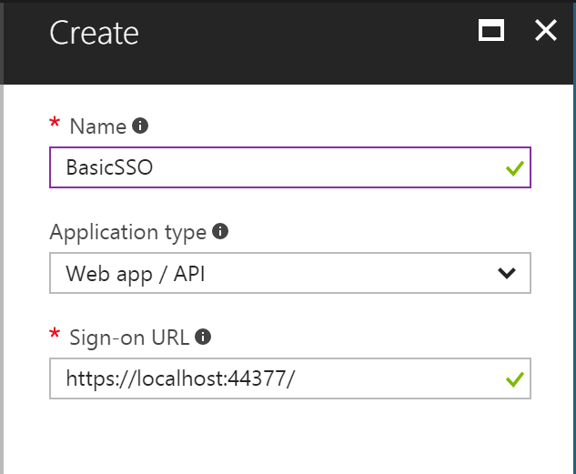
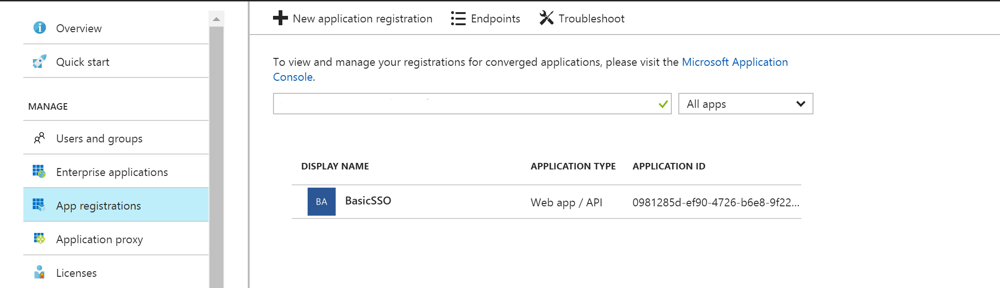
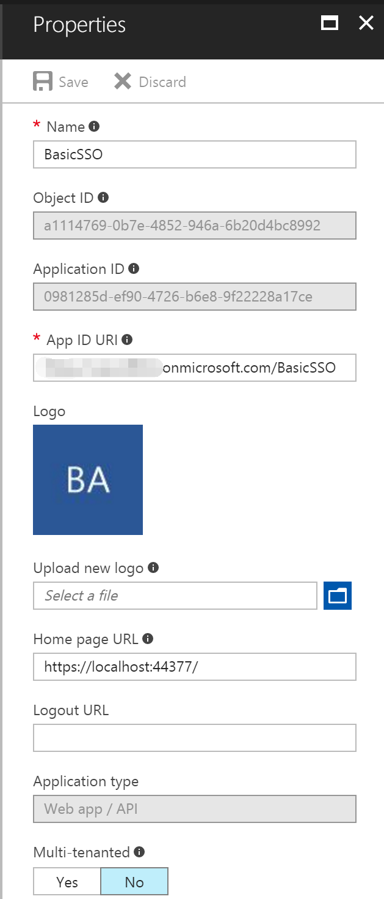
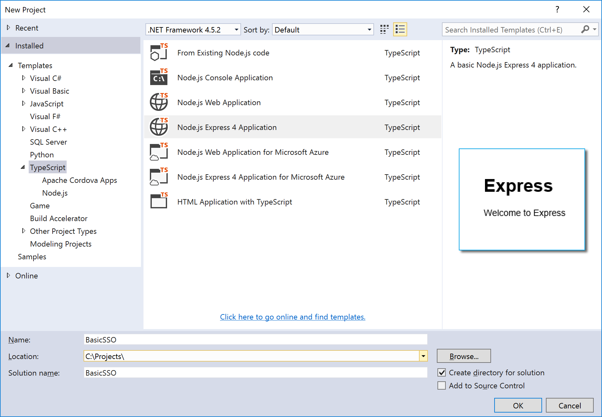
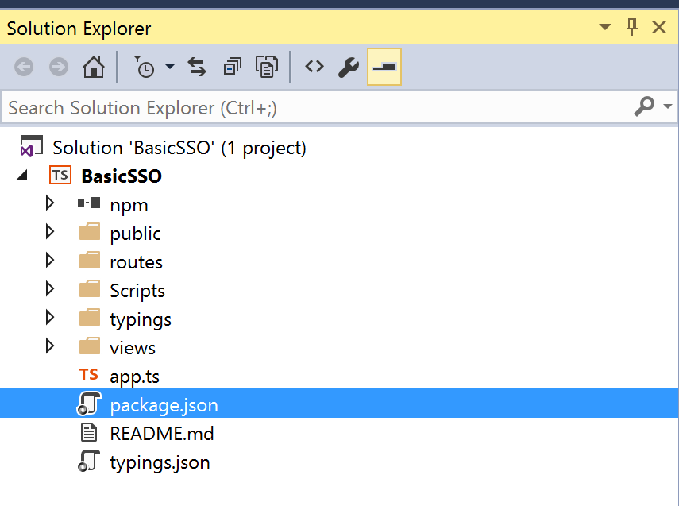
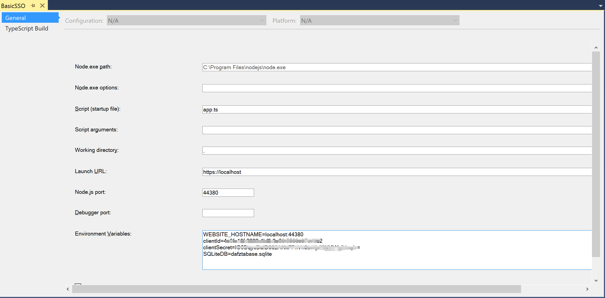
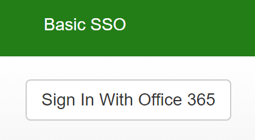
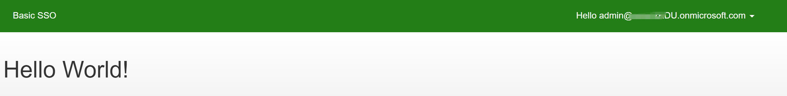

# Basic SSO - Angular/Node version

In this sample we show you how to integrate Azure Active Directory(Azure AD) to provide secure sign in and authorization. 

**Table of contents**
* [Register the application in Azure Active Directory](#register-the-application-in-azure-active-directory)
* [Prerequisites](#Prerequisites)
* [Build and debug locally](#build-and-debug-locally)


## Register the application in Azure Active Directory

1. Sign in to the Azure portal: [https://portal.azure.com/](https://portal.azure.com/).

2. Choose your Azure AD tenant by selecting your account in the top right corner of the page.


3. Click **Azure Active Directory** -> **App registrations** -> **+Add**.

4. Input a **Name**, and select **Web app / API** as **Application Type**.

   Input **Sign-on URL**: https://localhost:44377/

   

   Click **Create**.

5. Once completed, the app will show in the list.

   

6. Click it to view its details. 

   

7. Click **All settings**, if the setting window did not show.

     

     Copy aside **Application ID**, then Click **Save**.

   * Click **Reply URLs**, add the following URL into it.

     [https://localhost:44380/auth/openid/return](https://YOUR HOST URL/auth/openid/return)

     ​

   * Click **Required permissions**. Add the following permissions:

     | API                            | Application Permissions | Delegated Permissions         |
     | ------------------------------ | ----------------------- | ----------------------------- |
     | Windows Azure Active Directory |                         | Sign in and read user profile |

     

   * Click **Keys**, then add a new key

     

     Click **Save**, then copy aside the **VALUE** of the key. 

   Close the Settings window.


## Prerequisites

- Visual Studio 2015 (any edition), [Visual Studio 2015 Community](https://go.microsoft.com/fwlink/?LinkId=691978&clcid=0x409) is available for free.

- [TypeScript for Visual Studio 2015](https://www.microsoft.com/en-us/download/details.aspx?id=48593)

- [Node.js v6.11.2](https://nodejs.org/en/download/)

- [Node.js Tools 1.3](https://github.com/Microsoft/nodejstools/releases/tag/v1.3)

- [Git](https://git-scm.com/download/win)

  Familiarity with Node.js, TypeScript, Angular and web services.

  ​

## Build and debug locally

1. Open Visual Studio 2015 as administrator, first we will create an empty project.

2. Click **File**->**New**->**Project**, select **Node.js Express4 Application**, create a web project named **BasicSSO**.

   

3. Open **package.json**  file after create project successfully.

   

4. Use the following packages to replace the **dependencies** section.

   ```xml
   "dependencies": {
       "@angular/common": "~4.3.4",
       "@angular/compiler": "~4.3.4",
       "@angular/core": "~4.3.4",
       "@angular/forms": "~4.3.4",
       "@angular/http": "~4.3.4",
       "@angular/platform-browser": "~4.3.4",
       "@angular/platform-browser-dynamic": "~4.3.4",
       "@angular/router": "~4.3.4",
       "@angular/upgrade": "~4.3.4",
       "adal-node": "^0.1.22",
       "angular-in-memory-web-api": "~0.3.0",
       "bluebird": "^3.4.6",
       "body-parser": "^1.15.2",
       "bootstrap": "3.3.7",
       "cookie-parser": "^1.4.3",
       "cookie-session": "^2.0.0-alpha.2",
       "core-js": "^2.4.1",
       "crypto-js": "^3.1.9-1",
       "express": "^4.14.0",
       "gulp": "github:gulpjs/gulp#4.0",
       "gulp-angular-embed-templates": "^2.3.0",
       "gulp-series": "^1.0.2",
       "gulp-typescript": "^3.1.3",
       "jsonwebtoken": "^7.2.1",
       "morgan": "^1.7.0",
       "passport": "^0.3.2",
       "passport-azure-ad": "^3.0.3",
       "rxjs": "5.0.1",
       "sequelize": "^3.27.0",
       "serve-favicon": "^2.3.2",
       "sqlite3": "^3.1.9",
       "stylus": "^0.54.5",
       "systemjs": "0.19.40",
       "systemjs-builder": "^0.15.34",
       "typescript": "^2.1.4",
       "zone.js": "^0.8.4"
     },
   ```

5. Add the following **devDependencies** section under the **dependencies** section.

   ```xml
     "devDependencies": {
       "@types/bcryptjs": "2.3.30",
       "@types/bluebird": "3.0.37",
       "@types/body-parser": "0.0.33",
       "@types/cookie-parser": "1.3.30",
       "@types/cookie-session": "2.0.32",
       "@types/crypto-js": "3.1.32",
       "@types/express": "4.0.34",
       "@types/express-serve-static-core": "4.0.40",
       "@types/jsonwebtoken": "7.2.0",
       "@types/morgan": "1.7.32",
       "@types/passport": "0.3.1",
       "@types/sequelize": "4.0.39",
       "@types/serve-favicon": "2.2.28",
       "@types/superagent": "2.0.36"
     }
   ```

6. Use the following **scripts** section to replace **scripts** section.

   ```xml
     "scripts": {
       "gulp": "gulp"
     },
   ```

7. Select **npm**, right-click and select **Install Missing npm Packages**

8. Delete the following files from project.

   - **Typings** ,  **Scripts** ,  **public** and **Views** folders
   - **routes/index.ts** ,  **routes/user.ts** files
   - **typings.json** file
   - **README.md** file

9. Copy the files of [Lab Files](Lab Files/) folder into the folder containing the `.njsproj`  file. Include **angular** files in the Visual Studio project as follows:

   - app/css/bootstrap.min.css
   - app/css/Site.css
   - app/header/header.component.template.html
   - app/header/header.component.ts
   - app/helper/authHelper.ts
   - app/helper/cookieHelper.ts
   - app/login/login.component.template.html
   - app/login/login.component.ts
   - app/app.component.css
   - app/app.component.template.html
   - app/app.component.ts
   - app/app.module.ts
   - app/app.routing.ts
   - app/main.ts
   - index.html

10. Include **server** files in the Visual Studio project as follows:

  - ssl/cert.pem
  - ssl/csr.pem
  - ssl/key.pem
  - constants.ts
  - gulpfile.js
  - systemjs.config.js
  - tsconfig.json

11. Open **app/helper/authHelper.ts** file, add the following code into **AuthHelper** class

    ```typescript
    public IsLogin(): boolean {
        var token = CookieHelper.get('authType');
        return token && token != "undefined";
    }

    public getCurrentUser() {
    	return this._http.get(this.meAPIUrl + '?t=' + new Date().getTime(), {})
    	.map((response: Response) => response.json());
    }

    login() {
    	window.location.href = "/auth/login/o365";
    }
    ```

12. Right-click project,  **Add ->New Folder** named **data**.

13. Right-click **data** folder,  **Add->New Item->TypeScript file** named **dbContext.ts**.

14. Add the following code to **dbContext.ts** file to create token cache table.

    ```typescript
    import * as Sequelize from 'sequelize';
    import * as Promise from "bluebird";
    import { Constants } from '../constants';
    ```


    export interface TokenCacheAttributes {
        userId: string;
        refreshToken: string;
        accessTokens: string;
    }
    export interface TokenCacheInstance extends Sequelize.Instance<TokenCacheAttributes>, TokenCacheAttributes {
    }
    export interface TokenCacheModel extends Sequelize.Model<TokenCacheInstance, TokenCacheAttributes> { }
    
    export class DbContext {
        public sequelize: Sequelize.Sequelize;
        public TokenCache: TokenCacheModel;
    
        constructor() {
            this.init();
        }
    
        public sync(options?: Sequelize.SyncOptions): Promise<any> {
            return this.sequelize.sync(options);
        }
    
        private init() {
            this.sequelize = new Sequelize("", "", "", {
                dialect: 'sqlite',
                storage: Constants.SQLiteDB
            });


            this.TokenCache = this.sequelize.define<TokenCacheInstance, TokenCacheAttributes>('TokenCache',
                {
                    userId: Sequelize.STRING,
                    refreshToken: Sequelize.TEXT,
                    accessTokens: Sequelize.TEXT,
                },
                {
                    timestamps: false,
                    tableName: "TokenCache"
                });
        }
    }
    ​```


17. Right-click project,  **Add ->New Folder** named **services**.

18. Right-click **services** folder,  **Add->New Item->TypeScript file** named **tokenCacheService.ts**.

19. Add the following code to **tokenCacheService.ts** file to create/update/delete token cache.

    ```typescript
    import { DbContext, TokenCacheInstance } from '../data/dbContext';
    import * as Promise from "bluebird";
    import { Constants } from '../constants';

    // In this sample, tokens are cached in clear text in database. For real projects, they should be encrypted.
    export class TokenCacheService {

        private dbContext = new DbContext();

        public get(userId: string): Promise<TokenCacheInstance> {
            return this.dbContext.TokenCache.findOne({ where: { userId: userId } });
        }

        public createOrUpdate(userId: string, resource: string, authResult: any): Promise<TokenCacheInstance> {
            return this.dbContext.TokenCache.findOne({ where: { userId: userId } })
                .then(tokenCache => {
                    if (tokenCache == null) return this.create(userId, resource, authResult);
                    else return this.update(tokenCache, resource, authResult);
                });
        }

        public update(tokenCache: TokenCacheInstance, resource: string, authResult: any): Promise<TokenCacheInstance> {
            let accessTokens = JSON.parse(tokenCache.accessTokens);
            accessTokens[resource] = {
                expiresOn: authResult.expiresOn,
                value: authResult.accessToken
            }
            tokenCache.refreshToken = authResult.refreshToken;
            tokenCache.accessTokens = JSON.stringify(accessTokens);
            return tokenCache.save();
        }

        public create(userId: string, resource: string, authResult: any): Promise<TokenCacheInstance> {
            let accessTokens = {};
            accessTokens[resource] = {
                expiresOn: authResult.expiresOn,
                value: authResult.accessToken
            };
            return this.dbContext.TokenCache.create({
                userId: userId,
                refreshToken: authResult.refreshToken,
                accessTokens: JSON.stringify(accessTokens)
            })
        }

        public clearUserTokenCache(): Promise<any> {
            return this.dbContext.TokenCache.all()
                .then(caches => {
                    let promises = new Array<Promise<any>>();
                    caches.forEach(cach => {
                        promises.push(cach.destroy());
                    })
                    return Promise.all(promises);
                });
        }
    }
    ```

20. Right-click project,  **Add ->New Folder** named **auth**.

21. Right-click **auth** folder, **Add->New Item->TypeScript file** named **appAuth.ts**.

22. Add the following code to **appAuth.ts** file to authentication.


```typescript
    var express = require("express");
var passport = require("passport");
import https = require('https');
import { TokenCacheService } from '../services/tokenCacheService';
import { Constants } from '../constants';

var tokenCache = new TokenCacheService();

export class appAuth {
    private app: any = null;

    //AAD authentication strategy
    private OIDCStrategy = require('../node_modules/passport-azure-ad/lib/index').OIDCStrategy;

    constructor(app: any) {
        this.app = app;

        passport.serializeUser(function (user, done) {
            done(null, user);
        });

        passport.deserializeUser(function (user, done) {
            done(null, user);
        });

        passport.use('O365', this.constructOIDCStrategy());
    }

    constructOIDCStrategy() {
        return new this.OIDCStrategy({
            identityMetadata: Constants.IdentityMetadata,
            clientID: Constants.ClientId,
            responseType: 'code',
            responseMode: 'form_post',
            redirectUrl: this.app.get('env') === 'development'
                ? 'https://localhost:44380/auth/openid/return'
                : 'https://' + Constants.Host + '/auth/openid/return',
            allowHttpForRedirectUrl: true,
            clientSecret: Constants.ClientSecret,
            validateIssuer: false,
            isB2C: false,
            passReqToCallback: true,
            loggingLevel: 'info',
            nonceLifetime: null,
        }, function (req, iss, sub, profile, jwtClaims, access_token, refresh_token, params, done) {
            if (!profile.oid) {
                return done(new Error("No oid found"), null);
            }
            profile.tid = profile._json.tid;
            profile.authType = 'O365';
            req.res.cookie('authType', 'O365');

            var tokenCacheService = new TokenCacheService();
            tokenCacheService.createOrUpdate(profile.oid, Constants.AADGraphResource, {
                refreshToken: refresh_token,
                accessToken: access_token,
                expiresOn: new Date(parseInt(params.expires_on) * 1000)
            }).then(item => {
                done(null, profile);
            });
        });
    }


    ensureAuthenticated(req, res, next) {
        if (req.isAuthenticated()) {
            return next();
        }
        else if (req.baseUrl.startsWith("/api/")) {
            res.send(401, 'missing authorization header');
        }
        res.redirect('/');
    }

    public initPassport(app: any) {
        app.use(passport.initialize());
        app.use(passport.session());
    }

    public initAuthRoute(app: any) {

        app.get('/auth/login/o365', function (req, res, next) {
            var email = '';
            passport.authenticate('O365', {
                resourceURL: Constants.AADGraphResource,
                customState: 'my_state',
                failureRedirect: '/',
                login_hint: email
            })(req, res, next);
        });

        app.get('/auth/openid/return', passport.authenticate('O365', { failureRedirect: '/' }), function (req, res) {
            res.redirect('/');
        });

        app.post('/auth/openid/return', passport.authenticate('O365', { failureRedirect: '/' }), function (req, res) {
            res.redirect('/');
        });

        app.get('/logout', function (req, res) {
            let authType = req.cookies['authType'];
            res.clearCookie('authType');
            req.logOut();
            req.session = null;
            if (authType == 'O365')
                res.redirect(Constants.Authority + 'oauth2/logout?post_logout_redirect_uri=' + req.protocol + '://' + req.get('host'));
            else
                res.redirect('/');
        });
    }
}    
```

23. Right click **routes** folder, **Add->New Item->TypeScript file** named **me.ts**.

24. Add the following code to **me.ts** file to authentication.
    ```typescript
    import express = require('express');

    var router = express.Router();

    router.get('/', function (req, res) {
        var u = req.user;
        if (u != null && u.upn != null) {
            res.json({ email: u.upn })
        }
        else {
            res.json(500)
        }
    })

    export = router;
    ```

25. Open **app.ts** file, delete all code and copy the following code into it.

    ```typescript
    import { appAuth } from './auth/appAuth';
    var http = require("http");
    var https = require("https");
    var cookieSession = require('cookie-session');
    var express = require("express");
    var path = require("path");
    var logger = require("morgan");
    var cookieParser = require("cookie-parser");
    var bodyParser = require("body-parser");
    var fs = require("fs");
    var url = require("url");
    var dbContext_1 = require("./data/dbContext");
    var meRoute = require("./routes/me");
    var app = express();

    // Authentication
    var auth = new appAuth(app);

    // Angular
    app.use("/app", express.static(path.join(__dirname, 'app')));
    app.use("/node_modules", express.static(path.join(__dirname, 'node_modules'), { maxAge: 1000 * 60 * 60 * 24 }));
    app.get("/systemjs.config.js", function (req, res) {
        res.sendfile(path.join(__dirname, 'systemjs.config.js'));
    });

    // Config the app
    app.use(logger('dev'));
    app.use(cookieSession({
        name: 'session',
        keys: ['key1', 'key2'],
        maxAge: 24 * 60 * 60 * 1000 // 24 hours
    }));
    app.use(bodyParser.json());
    app.use(bodyParser.urlencoded({ extended: true }));
    app.use(cookieParser());
    app.use(require('stylus').middleware(path.join(__dirname, 'public')));

    // Initialize Passport
    auth.initPassport(app);

    app.use(express.static(path.join(__dirname, 'public')));

    // APIs
    app.use('/api/me', auth.ensureAuthenticated, meRoute);

    // Configure auth route
    auth.initAuthRoute(app);

    // Pass constants to client side through cookie
    app.get('/*', function (req, res) {
        res.sendfile(path.join(__dirname, "index.html"));
    });

    // Catch 404 and forward to error handler
    app.use(function (req, res, next) {
        var err = new Error('Not Found');
        err['status'] = 404;
        next(err);
    });

    // Handle errors
    if (app.get('env') === 'development') {
        app.use(function (err, req, res, next) {
            res.status(err['status'] || 500);
            res.render('error', {
                message: err.message,
                error: err
            });
        });
    }

    app.use(function (err, req, res, next) {
        res.status(err['status'] || 500);
        res.render('error', {
            message: err.message,
            error: {}
        });
    });

    // Sync database
    var db = new dbContext_1.DbContext();
    db.sync({ force: false }).then(function () { });

    // Create server
    var port = process.env.port || 1337;
    if (app.get('env') === 'development') {
        https.createServer({
            key: fs.readFileSync('ssl/key.pem'),
            cert: fs.readFileSync('ssl/cert.pem')
        }, app).listen(port);
    }
    else {
        http.createServer(app).listen(port, function () {
            console.log('Express server listening on port ' + port);
        });
    }
    ```

26. Select Project file, click right key and select **Properties**, 

    - Change Script to **app.ts**

    - Change Launch URL to **https://localhost**

    - Change Node.js port to **44380**

    - Set the following to Environment Variables

      WEBSITE_HOSTNAME=localhost:44380

      clientId=INSERT YOUR CLIENT ID HERE

      clientSecret=INSERT YOUR CLIENT SECRET HERE

      SQLiteDB=dafztabase.sqlite

      

    ​       **clientId**: use the Client Id of the app registration you created earlier.

    ​      **clientSecret**: use the Key value of the app registration you created earlier.

    ​

27. Press F5, click **Sign In with Office 365** button to sign in.

    

28. Hello world page is presented after login successfully . 

    


**Copyright (c) 2017 Microsoft. All rights reserved.**
