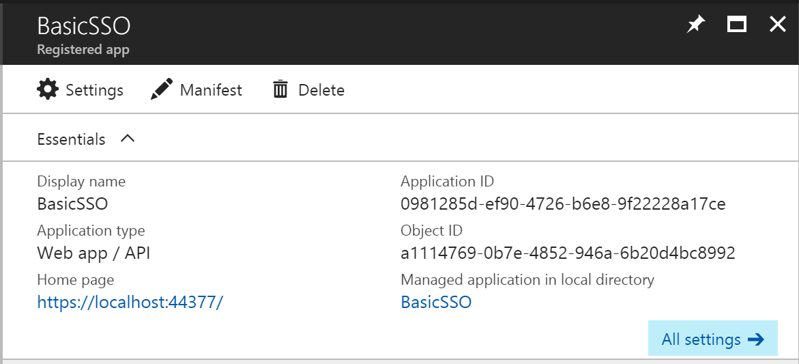
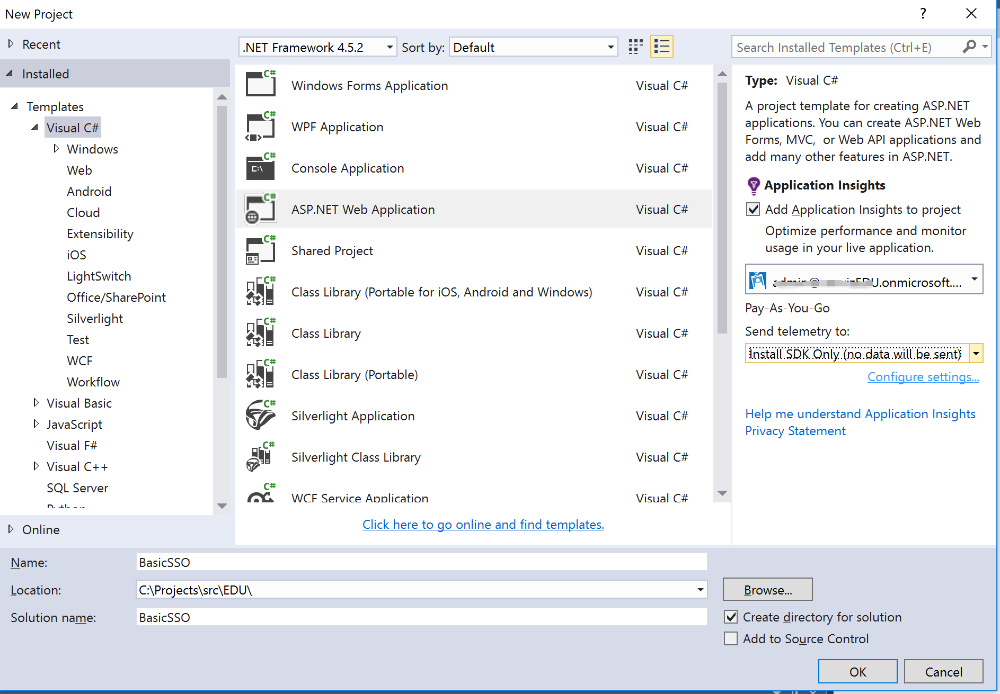
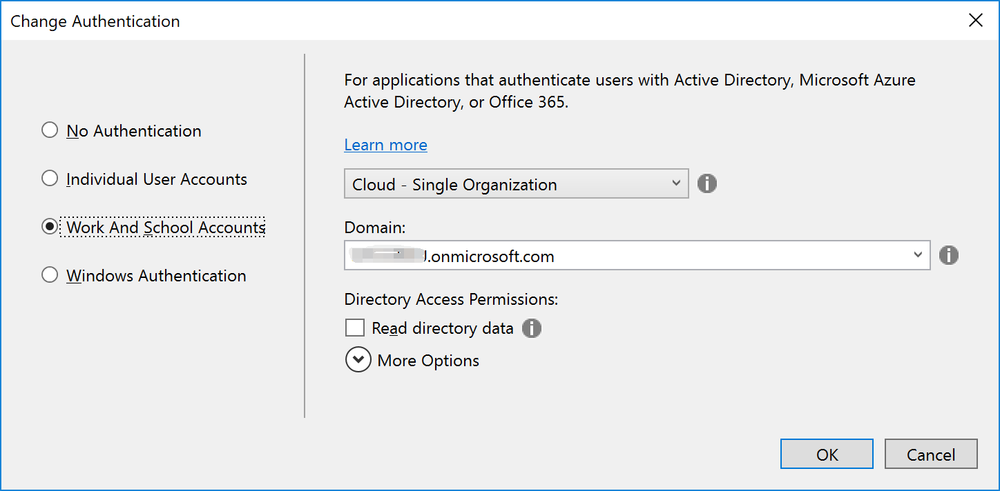
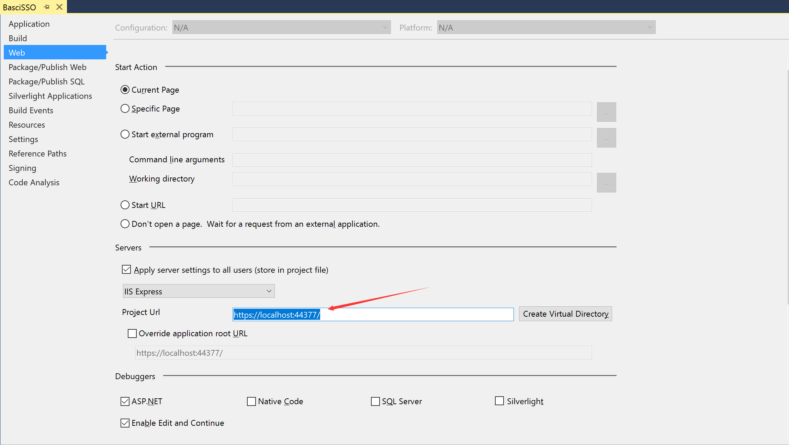
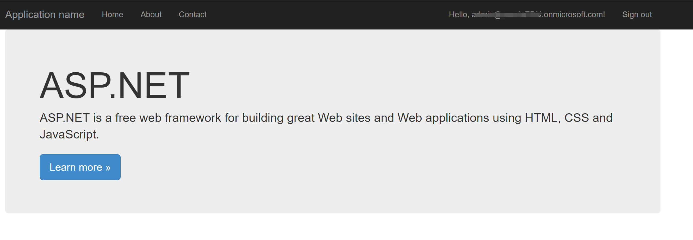

# Basic SSO - .NET version

In this sample we show you how to integrate Azure Active Directory(Azure AD) to provide secure sign in and authorization. 

**Table of contents**
* [Register the application in Azure Active Directory](#register-the-application-in-azure-active-directory)
* [Build and debug locally](#build-and-debug-locally)


## Register the application in Azure Active Directory

1. Sign in to the Azure portal: [https://portal.azure.com/](https://portal.azure.com/).

2. Choose your Azure AD tenant by selecting your account in the top right corner of the page.

3. Click **Azure Active Directory** -> **App registrations** -> **+Add**.

4. Input a **Name**, and select **Web app / API** as **Application Type**.

   Input **Sign-on URL**: https://localhost:44377/

   

   Click **Create**.

5. Once completed, the app will show in the list.

   

6. Click it to view its details. 

   

7. Click **All settings**, if the setting window did not show.

     

     Copy aside **Application ID**, then Click **Save**.

   * Click **Required permissions**. Add the following permissions:

     | API                            | Application Permissions | Delegated Permissions         |
     | ------------------------------ | ----------------------- | ----------------------------- |
     | Windows Azure Active Directory |                         | Sign in and read user profile |

     

   * Click **Keys**, then add a new key

     

     Click **Save**, then copy aside the **VALUE** of the key. 

   Close the Settings window.


## Build and debug locally

This project can be opened with the edition of Visual Studio 2015 you already have, or download and install the Community edition to run, build and/or develop this application locally.

- [Visual Studio 2015 Community](https://go.microsoft.com/fwlink/?LinkId=691978&clcid=0x409)

Debug the **EDUGraphAPI.Web**:

1. Open Visual Studio 2015 as administrator, first we will create an empty project.

2. Click **File**->**New**->**Project**, select **ASP.NET Web Application**, create a web project named **BasicSSO**.

   

3. Select **MVC** template. 

   

4. Change authentication as following.

   

   ​

5. After created project successfully, select **Tools** -> **Nuget Package Manager** -> **Package Manager Console**.

6. Install **EntityFramework**, **EntityFramework.SqlServerCompact**  and  **Microsoft.IdentityModel.Clients.ActiveDirectory**.

   ~~~c#
   Install-Package EntityFramework
   Install-Package EntityFramework.SqlServerCompact
   Install-Package Microsoft.IdentityModel.Clients.ActiveDirectory
   ~~~

7. On the **Models** folder, add two files named **AdalTokenCache.cs** and **ApplicationDbContext.cs** to store user cache.

8. Open **AdalTokenCache.cs**  file, delete all code and copy the following code to paste.

       using Microsoft.IdentityModel.Clients.ActiveDirectory;
              using System;
              using System.Linq;
              using System.Web.Security;
              
              namespace BasicSSO.Models
              {
                  public class AdalTokenCache : TokenCache
                  {
                      private static readonly string MachinKeyProtectPurpose = "ADALCache";
              
                      private string userId;
              
                      public AdalTokenCache(string signedInUserId)
                      {
                          this.userId = signedInUserId;
                          this.AfterAccess = AfterAccessNotification;
                          this.BeforeAccess = BeforeAccessNotification;
              
                          GetCacheAndDeserialize();
                      }
              
                      public override void Clear()
                      {
                          base.Clear();
                          ClearUserTokenCache(userId);
                      }
              
                      void BeforeAccessNotification(TokenCacheNotificationArgs args)
                      {
                          GetCacheAndDeserialize();
                      }
              
                      void AfterAccessNotification(TokenCacheNotificationArgs args)
                      {
                          if (this.HasStateChanged)
                          {
                              SerializeAndUpdateCache();
                              this.HasStateChanged = false;
                          }
                      }


                      private void GetCacheAndDeserialize()
                      {
                          var cacheBits = GetUserTokenCache(userId);
                          if (cacheBits != null)
                          {
                              try
                              {
                                  var data = MachineKey.Unprotect(cacheBits, MachinKeyProtectPurpose);
                                  this.Deserialize(data);
                              }
                              catch { }
                          }
                      }
              
                      private void SerializeAndUpdateCache()
                      {
                          var cacheBits = MachineKey.Protect(this.Serialize(), MachinKeyProtectPurpose);
                          UpdateUserTokenCache(userId, cacheBits);
                      }


                      private byte[] GetUserTokenCache(string userId)
                      {
                          using (var db = new ApplicationDbContext())
                          {
                              var cache = GetUserTokenCache(db, userId);
                              return cache != null ? cache.cacheBits : null;
                          }
                      }
              
                      private void UpdateUserTokenCache(string userId, byte[] cacheBits)
                      {
                          using (var db = new ApplicationDbContext())
                          {
                              var cache = GetUserTokenCache(db, userId);
                              if (cache == null)
                              {
                                  cache = new UserTokenCache { webUserUniqueId = userId };
                                  db.UserTokenCacheList.Add(cache);
                              }
              
                              cache.cacheBits = cacheBits;
                              cache.LastWrite = DateTime.UtcNow;
              
                              db.SaveChanges();
                          }
                      }
              
                      private UserTokenCache GetUserTokenCache(ApplicationDbContext db, string userId)
                      {
                          return db.UserTokenCacheList
                                 .OrderByDescending(i => i.LastWrite)
                                 .FirstOrDefault(c => c.webUserUniqueId == userId);
                      }
              
                      private void ClearUserTokenCache(string userId)
                      {
                          using (var db = new ApplicationDbContext())
                          {
                              var cacheEntries = db.UserTokenCacheList
                                  .Where(c => c.webUserUniqueId == userId)
                                  .ToArray();
                              db.UserTokenCacheList.RemoveRange(cacheEntries);
                              db.SaveChanges();
                          }
                      }
              
                      public static void ClearUserTokenCache()
                      {
                          using (var db = new ApplicationDbContext())
                          {
                              var cacheEntries = db.UserTokenCacheList
                                  .ToArray();
                              db.UserTokenCacheList.RemoveRange(cacheEntries);
                              db.SaveChanges();
                          }
                      }
                  }
              }


9. Open **ApplicationDbContext.cs**  file,  delete all code and copy the following code to paste.

       using System;
              using System.ComponentModel.DataAnnotations;
              using System.Data.Entity;
              
              namespace BasicSSO.Models
              {
                  public class ApplicationDbContext : DbContext
                  {
                      public ApplicationDbContext()
                          : base("DefaultConnection")
                      {
                      }
              
                      public DbSet<UserTokenCache> UserTokenCacheList { get; set; }
                  }
              
                  public class UserTokenCache
                  {
                      [Key]
                      public int UserTokenCacheId { get; set; }
              
                      public string webUserUniqueId { get; set; }
              
                      [MaxLength]
                      public byte[] cacheBits { get; set; }
              
                      public DateTime LastWrite { get; set; }
                  }
              }


10. Open **Web.config** file, add the following connection strings to **configuration**

  ```xml
   <connectionStrings>
     <add name="DefaultConnection" connectionString="Data Source=|DataDirectory|BasicSSO.sdf" providerName="System.Data.SqlServerCe.4.0" />
   </connectionStrings>
  ```

11. Find **appSetings** section, replace the **appSettings** using the following code.  

    ```xml
      <appSettings>
        <add key="webpages:Version" value="3.0.0.0" />
        <add key="webpages:Enabled" value="false" />
        <add key="ClientValidationEnabled" value="true" />
        <add key="UnobtrusiveJavaScriptEnabled" value="true" />

        <add key="ida:AADInstance" value="https://login.microsoftonline.com/" />
        <add key="ida:ClientId" value="INSERT YOUR CLIENT ID HERE" />
        <add key="ida:ClientSecret" value="INSERT YOUR CLIENT SECRET HERE" />
      </appSettings>
    ```
    - **ida:ClientId**: use the Client Id of the app registration you created earlier.

    - **ida:ClientSecret**: use the Key value of the app registration you created earlier.

      ​

12. Open **App_Start** ->  **Startup.Auth.cs**, delete all code and copy the following code to paste

    ```
    using System;
    using System.Configuration;
    using System.IdentityModel.Claims;
    using System.Threading.Tasks;
    using System.Web;
    using Microsoft.Owin.Security;
    using Microsoft.Owin.Security.Cookies;
    using Microsoft.Owin.Security.OpenIdConnect;
    using Microsoft.IdentityModel.Clients.ActiveDirectory;
    using Owin;
    using BasicSSO.Models;

    namespace BasciSSO
    {
        public partial class Startup
        {
            private static string clientId = ConfigurationManager.AppSettings["ida:ClientId"];
            private static string clientSecret = ConfigurationManager.AppSettings["ida:ClientSecret"];
            public static readonly string Authority = ConfigurationManager.AppSettings["ida:AADInstance"] + "common/";
            public static string AADGraph = "https://graph.windows.net";

            public void ConfigureAuth(IAppBuilder app)
            {
                app.SetDefaultSignInAsAuthenticationType(CookieAuthenticationDefaults.AuthenticationType);

                app.UseCookieAuthentication(new CookieAuthenticationOptions { });

                app.UseOpenIdConnectAuthentication(
                    new OpenIdConnectAuthenticationOptions
                    {
                        Caption = "Microsoft Work or school account",
                        ClientId = clientId,
                        Authority = Authority,
                        TokenValidationParameters = new System.IdentityModel.Tokens.TokenValidationParameters
                        {
                            // instead of using the default validation (validating against a single issuer value, as we do in line of business apps), 
                            // we inject our own multitenant validation logic
                            ValidateIssuer = false,
                        },
                        Notifications = new OpenIdConnectAuthenticationNotifications()
                        {
                            RedirectToIdentityProvider = (context) =>
                            {
                                // This ensures that the address used for sign in and sign out is picked up dynamically from the request
                                // this allows you to deploy your app (to Azure Web Sites, for example)without having to change settings
                                // Remember that the base URL of the address used here must be provisioned in Azure AD beforehand.
                                string appBaseUrl = context.Request.Scheme + "://" + context.Request.Host + context.Request.PathBase;
                                context.ProtocolMessage.RedirectUri = appBaseUrl + "/";
                                context.ProtocolMessage.PostLogoutRedirectUri = appBaseUrl;
                                return Task.FromResult(0);
                            },
                            AuthorizationCodeReceived = async (context) =>
                            {
                                var identity = context.AuthenticationTicket.Identity;

                                // Get token with authorization code
                                Uri redirectUri = new Uri(HttpContext.Current.Request.Url.GetLeftPart(UriPartial.Path));
                                ClientCredential credential = new ClientCredential(clientId, clientSecret);
                                string signedInUserID = context.AuthenticationTicket.Identity.FindFirst(ClaimTypes.NameIdentifier).Value;
                                AuthenticationContext authContext = new AuthenticationContext(Authority, new AdalTokenCache(signedInUserID));
                                AuthenticationResult authResult = await authContext.AcquireTokenByAuthorizationCodeAsync(context.Code,
                                    redirectUri, credential, AADGraph);
                            },
                            AuthenticationFailed = (context) =>
                            {
                                var redirectUrl = "/Error?message=" + Uri.EscapeDataString(context.Exception.Message);
                                context.OwinContext.Response.Redirect(redirectUrl);
                                context.HandleResponse(); // Suppress the exception
                                return Task.FromResult(0);
                            }
                        }
                    });
            }
        }
    }
    ```
    ​

13. On **Controllers** folder, create new controller named **ErrorController**.

14. Open **ErrorController** file, delete all code and copy the following code to paste
```
using System.Web.Mvc;
        
namespace BasicSSO.Controllers
    {
        public class ErrorController : Controller
        {
            //
            // GET: /Error/Index
            public ActionResult Index(string message)
            {
                return View((object)message);
            }
        }
    }
```

15. On **Views** -> **Error**, create new view named **Index** 

16. Open **Index**, delete all code and copy the following code to paste
```
@model string
@{
    ViewBag.Title = "Error";
}
    <h2 class="text-danger">Error</h2>
    <h3 class="text-danger">@Model</h3>
```

17. Select Project file, click right key and select **Properties**, change Project Url to **https://localhost:44377/**

    

18. Press F5, hello world page is presented after login successfully. 

    


**Copyright (c) 2017 Microsoft. All rights reserved.**
