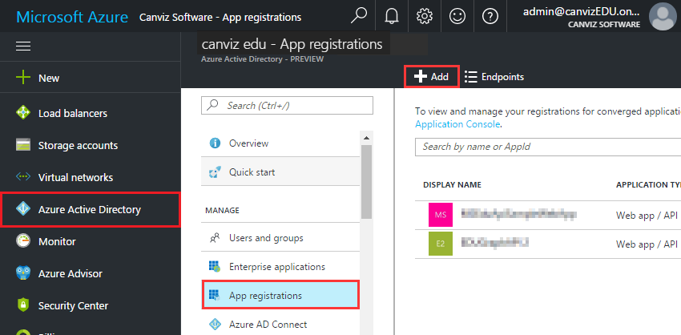
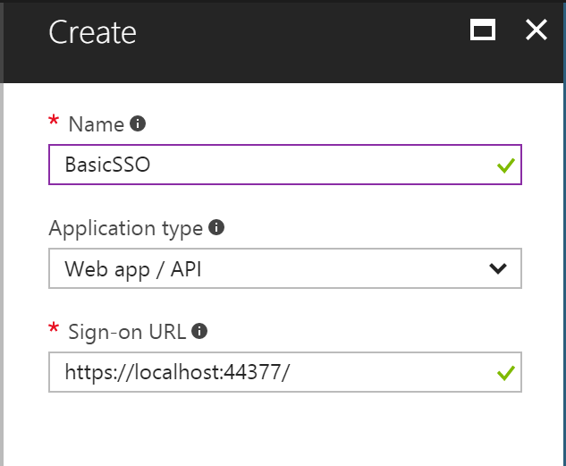
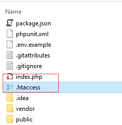

# Basic SSO - PHP version

In this sample we show you how to integrate Azure Active Directory(Azure AD) to provide secure sign in and authorization. 

**Table of contents**
* [Register the application in Azure Active Directory](#register-the-application-in-azure-active-directory)
* [Build and debug locally](#build-and-debug-locally)


## Register the application in Azure Active Directory

1. Sign in to the Azure portal: [https://portal.azure.com/](https://portal.azure.com/).

2. Choose your Azure AD tenant by selecting your account in the top right corner of the page.

3. Click **Azure Active Directory** -> **App registrations** -> **+Add**.

   

4. Input a **Name**, and select **Web app / API** as **Application Type**.

   Input **Sign-on URL**: https://localhost:44377/

   

   Click **Create**.

5. Once completed, the app will show in the list.

   

6. Click it to view its details. 

   

7. Click **All settings**, if the setting window did not show.

     

     Copy aside **Application ID**, then Click **Save**.

   * Click **Required permissions**. Add the following permissions:

     | API                            | Application Permissions | Delegated Permissions         |
     | ------------------------------ | ----------------------- | ----------------------------- |
     | Windows Azure Active Directory |                         | Sign in and read user profile |

     

   * Click **Keys**, then add a new key

     

     Click **Save**, then copy aside the **VALUE** of the key. 

   Close the Settings window.


## Build and debug locally

Make sure that Laravel 5.4 can run on local machine. Otherwise following [this article](https://laravel.com/docs/5.4/installation) to create a dev environment. 

 PHPStorm is used as editor.


#### Create a new Laravel project.

1. Via Composer Create-Project
   Open command prompt and location to a folder that want to create Laravel project. Run the common below. You can rename **BasicSSO** to whatever that make sense.  

   `composer create-project laravel/laravel BasicSSO`

2. Enable authentication

   After project created, run the command to enable authentication.

   `php artisan make:auth`

#### Update source code

1. Rename **server.php** to **index.php**. Copy **.htaccess** from **/public** folder to the root folder of **BasicSSO**.  After completed it will like image below.

   

2. Edit **composer.json** in root folder of BasicSSO. Update “required” section as below:

   ```
   "require": {
       "php": ">=5.6.4",
       "kozz/laravel-guzzle-provider": "~6.0",
       "laravel/framework": "5.4.*",
       "laravel/socialite": "~3.0",
       "laravel/tinker": "~1.0",
       "lcobucci/jwt": "3.2.1",
       "league/oauth2-client": "^1.4",
       "microsoft/microsoft-graph": "^0.1.0",
       "socialiteproviders/microsoft-azure": "^3.0"
   }
   ```

   Save edit **composer.json** and then run the command to update composer.

   `composer update`

3. Edit **.evn** file in root folder of **BasicSSO**. Add **CLIENT_ID** and **CLIENT_SECRET** to the file.

   - **CLIENT_ID**: use the Client Id of the app registration you created earlier.
   - **CLIENT_SECRET**: use the Key value of the app registration you created earlier.


4. Open the **BasicSSO** project with PHPStorm. Create a new file named **LogoutController.php** under **app\Http\Controllers\Auth** folder. Delete all code and copy the following code to paste.

```
<?php

namespace App\Http\Controllers\Auth;


use App\Config\UserType;
use App\Http\Controllers\Controller;
use Illuminate\Support\Facades\Auth;
use Illuminate\Support\Facades\Redirect;
use Illuminate\Support\Facades\Session;

class LogoutController extends Controller
{

    public function logout()
    {
        Session::flush();
        $_SESSION=array();
        session_destroy();
        if(Auth::check() &&  Auth::user()->userType==UserType::Local)
            Auth::logout();

        $redirectURl=urlencode('http'.(empty($_SERVER['HTTPS'])?'':'s').'://'.$_SERVER['HTTP_HOST']);
        $url = 'https://login.microsoftonline.com/common/oauth2/logout?post_logout_redirect_uri='.$redirectURl;
        return Redirect::to($url);
    }
}
```

5.  Create a new file named **O365AuthController.php** under **app\Http\Controllers** folder. Delete all code and copy the following code to paste.

```
<?php

namespace App\Http\Controllers;

use App\Http\Middleware\SocializeAuthMiddleware;

use App\User;
use Illuminate\Support\Facades\Auth;
use Laravel\Socialite\Facades\Socialite;
use Microsoft\Graph\Connect\Constants;
use Socialize;


class O365AuthController extends Controller
{

    public function __construct()
    {

    }
    /**
     * Redirect the user to the OAuth Provider.
     */
    public function o365Login()
    {
        return Socialize::with('O365')->redirect();
    }

    /**
     * Handle provider callback.
     */
    public function oauth()
    {
        $o365User = Socialite::driver('O365')->user();
        SocializeAuthMiddleware::setSocializeSessions($o365User, '', '');
        return redirect('/');
    }

}
```

6. Create a new file named **SocializeAuthMiddleware.php** under **app\Http\Middleware** folder. Delete all code and copy the following code to paste.

```
<?php

namespace App\Http\Middleware;

use App\Config\SiteConstants;
use App\Config\UserType;
use Closure;
use Illuminate\Support\Facades\Auth;
use App\User;

class SocializeAuthMiddleware
{
    /**
     * Integrate O365 user with PHP authentication framework. The current O365 user could be got through Auth:user().
     *
     * @param  \Illuminate\Http\Request $request
     * @param  \Closure $next
     * @return mixed
     */
    public function handle($request, Closure $next)
    {
        if (!Auth::user()) {
            if (isset($_SESSION[SiteConstants::SocializeUser])) {
                $userInfo = $_SESSION[SiteConstants::SocializeUser];
                $jsonUser = json_decode(json_encode($userInfo['user']));               
                $user = new User();
                $user->userType = UserType::O365;
                $user->firstName =$jsonUser->user->givenName;
                $user->lastName = $jsonUser->user->surname;
                $user->o365UserId = $jsonUser->id;
                $user->o365Email = $jsonUser->email;
                $user->OrganizationId = $userInfo['organizationId'];
                $user->tenantId = $userInfo['tenantId'];
                Auth::login($user);
            }
        }
        return $next($request);
    }

    public static function removeSocializeSessions()
    {
        $_SESSION[SiteConstants::SocializeUser]=null;
    }

    public static function setSocializeSessions($user,$orgId,$tenantId)
    {
        $arrData = array(
            'user'=>$user,
            'organizationId'=>$orgId,
            'tenantId' =>$tenantId
        );
        $_SESSION[SiteConstants::SocializeUser] = $arrData;
    }
}
```

7. Update **$middleware** under **\app\Http\Kernel.php**. 

```
protected $middleware = [
    \Illuminate\Foundation\Http\Middleware\CheckForMaintenanceMode::class,
    \Illuminate\Foundation\Http\Middleware\ValidatePostSize::class,
    \App\Http\Middleware\TrimStrings::class,
    \Illuminate\Foundation\Http\Middleware\ConvertEmptyStringsToNull::class,
   \App\Http\Middleware\SocializeAuthMiddleware::class,
];
```

8. Create a new file named **O365ExtendSocialite.php** under **app\Providers** folder. Delete all code and copy the following code to paste.

```
<?php
namespace App\Providers;

use SocialiteProviders\Manager\SocialiteWasCalled;

class O365ExtendSocialite
{
    /**
     * Execute the provider.
     */
    public function handle(SocialiteWasCalled $socialiteWasCalled)
    {
        $socialiteWasCalled->extendSocialite(
            'O365', __NAMESPACE__.'\O365Provider'
        );
    }
}
```

9. Create a new file named **O365Provider.php** under **app\Providers** folder. Delete all code and copy the following code to paste.

```
<?php

namespace App\Providers;

use App\Config\SiteConstants;


class O365Provider extends \SocialiteProviders\Azure\Provider
{

    protected $version = '1.6';

    /**
     * Overwrite the base method to enable login_hint.
     * {@inheritdoc}
     * If there's cookie for email, add a login_hint on O365 login url.
     */
    protected function getAuthUrl($state)
    {
        $url = parent::getAuthUrl($state);
        //login_hint
        $mail = '';
        $showPrompt = isset($_SESSION[SiteConstants::ShowLoginPrompt])?$_SESSION[SiteConstants::ShowLoginPrompt]:false;

        if (!$showPrompt) {
            if($mail)
                $url = $this->AddNewParameter($url,'login_hint',$mail);
        }else{
            $url = $this->AddNewParameter($url,'prompt','login');
        }
        return $url;
    }

    private function AddNewParameter($url,$parameter,$value)
    {
        if (strpos($url, '?') > 0) {
            return $url . '&' . $parameter .'=' . $value;
        } else {
           return $url = $url . '?' . $parameter .'=' . $value;
        }
    }

}
```

10. Update **\app\Providers\EventServiceProvider.php**.

  Insert below code to **$listen** array.

  ```
  \SocialiteProviders\Manager\SocialiteWasCalled::class => [
      'App\Providers\O365ExtendSocialite@handle',
  ],
  ```

11. Update **config\app.php**.

    Insert below code to the array **'providers'**.

    `\SocialiteProviders\Manager\ServiceProvider::class,`

    Insert below code to the array **'aliases'**.

    ` 'Socialize' => 'Laravel\Socialite\Facades\Socialite',`

12. create a new file named **graph.php** under **/config** folder. Delete all code and copy the following code to paste.

```
<?php
/**
 *  Copyright (c) Microsoft. All rights reserved. Licensed under the MIT license.
 *  See LICENSE in the project root for license information.
 *
 *  PHP version 5
 *
 *  @category Code_Sample
 *  @package  php-connect-sample
 *  @author   Microsoft
 *  @license  MIT License
 *  @link     http://github.com/microsoftgraph/php-connect-sample
 */

namespace Microsoft\Graph\Connect;

/**
 *  Stores constant and configuration values used through the app
 *
 *  @class    Constants
 *  @category Code_Sample
 *  @package  php-connect-sample
 *  @author   Microsoft
 *  @license  MIT License
 *  @link     http://github.com/microsoftgraph/php-connect-sample
 */
class Constants
{

    const CLIENT_ID               = 'CLIENT_ID';
    const CLIENT_SECRET           = 'CLIENT_SECRET';
    const SOURCECODERESPOSITORYURL= 'SOURCECODERESPOSITORYURL';

    const AUTHORITY_URL        = 'https://login.microsoftonline.com/common';
    const AUTHORIZE_ENDPOINT   = '/oauth2/authorize';
    const TOKEN_ENDPOINT       = '/oauth2/token';
    const MSGraph          = 'https://graph.microsoft.com';
    const AADGraph         = 'https://graph.windows.net';
    const MSGraph_VERSION  ='beta';

    const O365GroupConversationsUrlFormat = "https://outlook.office.com/owa/?path=/group/%s/mail&exsvurl=1&ispopout=0";


}
```

13. create a new file named **siteConstants.php** under **/config** folder. Delete all code and copy the following code to paste.

```
<?php
namespace App\Config;
class SiteConstants
{
    const Session_State                 ='SessionState';
    const Session_RedirectURL           ='SessionRedirectURL';
    const Session_EnabledUserCount      ='SessionEnabledUserCount';
    const AADCompanyAdminRoleName       = "Company Administrator";
    const Consent                       = "consent";
    const Login                         = "login";
    const AdminConsent                  = "admin_consent";
    const AdminConsentSucceedMessage    ='Admin consented successfully!';
    const AdminUnconsentMessage         ='Admin unconsented successfully!';
    const NoPrincipalError              ='Could not found the service principal. Please provdie the admin consent.';
    const EnableUserAccessFailed        ='Enable user access failed.';
    const UsernameCookie                ='O365CookieUsername';
    const EmailCookie                   ='O365CookieEmail';
    const SocializeUser                 ='SocializeUser';
    const DefaultPageSize               =12;
    const ShowLoginPrompt               ='ShowLoginPrompt';
}
 class Roles
{
     const Admin   = "Admin";
     const Faculty = "Faculty";
     const Student = "Student";
}
class UserType
{
    const Local = 'local';
    const O365 = 'O365';
}


```

14. Edit config\services.php. Delete all code and copy the following code to paste.

    ```
    <?php

    use Microsoft\Graph\Connect\Constants;

    return [

        /*
        |--------------------------------------------------------------------------
        | Third Party Services
        |--------------------------------------------------------------------------
        |
        | This file is for storing the credentials for third party services such
        | as Stripe, Mailgun, SparkPost and others. This file provides a sane
        | default location for this type of information, allowing packages
        | to have a conventional place to find your various credentials.
        |
        */

        'mailgun' => [
            'domain' => env('MAILGUN_DOMAIN'),
            'secret' => env('MAILGUN_SECRET'),
        ],

        'ses' => [
            'key' => env('SES_KEY'),
            'secret' => env('SES_SECRET'),
            'region' => 'us-east-1',
        ],

        'sparkpost' => [
            'secret' => env('SPARKPOST_SECRET'),
        ],

        'stripe' => [
            'model' => App\User::class,
            'key' => env('STRIPE_KEY'),
            'secret' => env('STRIPE_SECRET'),
        ],

        'O365' => [
            'client_id' => env(Constants::CLIENT_ID),
            'client_secret' => env(Constants::CLIENT_SECRET),
            'redirect' => 'http'.(empty($_SERVER['HTTPS'])?'':'s').'://'.$_SERVER['HTTP_HOST'].'/oauth.php',
        ],
    ];
    ```

15. Edit **resources\views\welcome.blade.php**. Delete all code and copy the following code to paste.

```
<!doctype html>
<html lang="{{ app()->getLocale() }}">
    <head>
        <meta charset="utf-8">
        <meta http-equiv="X-UA-Compatible" content="IE=edge">
        <meta name="viewport" content="width=device-width, initial-scale=1">

        <title>Laravel</title>

        <!-- Fonts -->
        <link href="https://fonts.googleapis.com/css?family=Raleway:100,600" rel="stylesheet" type="text/css">

        <!-- Styles -->
        <style>
            html, body {
                background-color: #fff;
                color: #636b6f;
                font-family: 'Raleway', sans-serif;
                font-weight: 100;
                height: 100vh;
                margin: 0;
            }

            .full-height {
                height: 100vh;
            }

            .flex-center {
                align-items: center;
                display: flex;
                justify-content: center;
            }

            .position-ref {
                position: relative;
            }

            .top-right {
                position: absolute;
                right: 10px;
                top: 18px;
            }

            .content {
                text-align: center;
            }

            .title {
                font-size: 84px;
            }

            .links > a {
                color: #636b6f;
                padding: 0 25px;
                font-size: 12px;
                font-weight: 600;
                letter-spacing: .1rem;
                text-decoration: none;
                text-transform: uppercase;
            }

            .m-b-md {
                margin-bottom: 30px;
            }
        </style>
    </head>
    <body>
        <div class="flex-center position-ref full-height">
            @if (Route::has('login'))
                <div class="top-right links">
                    @if (Auth::check())
                        
                        <a href="{{ url('/userlogout') }}">Log off</a>
                    @else
                        <a href="{{ url('/o365login') }}">Sign in with Office 365</a>
                    @endif
                </div>
            @endif

            <div class="content">
                <div class="title m-b-md">
                    @if (Auth::check())
                        Hello world!
                    @endif
                </div>


            </div>
        </div>
    </body>
</html>
```

15. Update **routes\web.php**. Delete all code and copy the following code to paste.

```
<?php


Route::get('/', function () {
    return view('welcome');
});

Auth::routes();

Route::get('/home', 'HomeController@index')->name('home');

Route::group(['middleware' => ['web']], function () {
    Route::get('/oauth.php', 'O365AuthController@oauth');
    Route::get('/o365login', 'O365AuthController@o365Login');
    Route::get('/userlogout', 'Auth\LogoutController@logout');
});
```

16. Run the project and you will see "SIGN IN WITH OFFICE 365" on top right corner. click and then login with your O365 account, it will show "Hello world!".


Copyright (c) 2017 Microsoft. All rights reserved.**