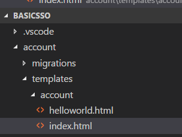
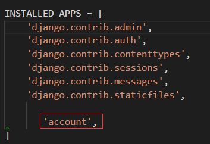
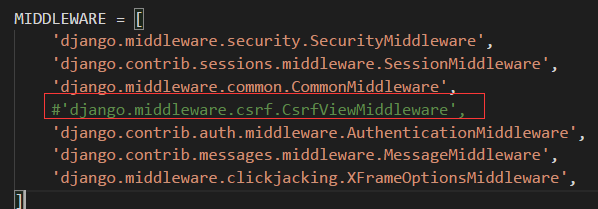

# Basic SSO - Python version

In this sample we show you how to integrate Azure Active Directory(Azure AD) to provide secure sign in and authorization. 

**Table of contents**
* [Register the application in Azure Active Directory](#register-the-application-in-azure-active-directory)
* [Build and debug locally](#build-and-debug-locally)


## Register the application in Azure Active Directory

1. Sign in to the Azure portal: [https://portal.azure.com/](https://portal.azure.com/).

2. Choose your Azure AD tenant by selecting your account in the top right corner of the page.

3. Click **Azure Active Directory** -> **App registrations** -> **+Add**.

   

4. Input a **Name**, and select **Web app / API** as **Application Type**.

   Input **Sign-on URL**: https://localhost:44377/

   

   Click **Create**.

5. Once completed, the app will show in the list.

   

6. Click it to view its details. 

   

7. Click **All settings**, if the setting window did not show.

     

     Copy aside **Application ID**, then Click **Save**.

   * Click **Required permissions**. Add the following permissions:

     | API                            | Application Permissions | Delegated Permissions         |
     | ------------------------------ | ----------------------- | ----------------------------- |
     | Windows Azure Active Directory |                         | Sign in and read user profile |

     

   * Click **Keys**, then add a new key

     

     Click **Save**, then copy aside the **VALUE** of the key. 

   Close the Settings window.


## Build and debug locally

Make sure that Django can run on local machine. Otherwise following [this article](https://docs.djangoproject.com/en/1.11/topics/install/) to create a dev environment. 

 Visual Studio code is used as editor.


#### Create a new Django project.

1. Creating a project

   From the command line, `cd` into a directory where you’d like to store your code, then run the following command. You can rename **BasicSSO** to whatever that make sense.  

   `django-admin startproject BasicSSO `

2. Creating the account app

   To create your app, make sure you’re in the same directory as `manage.py` and type this command:

   `python manage.py startapp account`

#### Update source code

1. Open **BasicSSO** project with Visual Studio code. Create a file named **env.bat** in the same directory as `manage.py`. Add **CLIENT_ID** and **CLIENT_SECRET** to the file.
   - **CLIENT_ID**: use the Client Id of the app registration you created earlier.
   - **CLIENT_SECRET**: use the Key value of the app registration you created earlier.

​           

2.  Create a new folder named **templates** under **account** folder, and then create a new folder named **account** under **templates** folder. Under new created account folder create two files named **index.html** and **helloworld.html**.

   ​    

Edit **index.html**,  delete all code and copy the following code to paste.

    <!DOCTYPE html>
    <html>
    <head>
    	<meta charset="utf-8" />
        <meta name="viewport" content="width=device-width, initial-scale=1.0">    
    <style>
        #socialLoginList{width:100%;margin:auto;text-align: center;}
        #socialLoginList input{height: 50px;width: 200px;}
    </style>
    </head>
    <body>
        <form action="/Account/O365Login" method="post">
            
    				<div id="socialLoginList">
    					<p>
    						<button type="submit" class="btn btn-default btn-ms-login" id="OpenIdConnect" name="provider" value="OpenIdConnect" title="Log in using your Microsoft Work or school account">Sign in with Office 365</button>
    					</p>
    				</div>
    	</form>
    </body>
    </html>
Edit **helloworld.html**, delete all code and copy the following code to paste.

    <!DOCTYPE html>
    <html>
    <head>
    	<meta charset="utf-8" />
        <meta name="viewport" content="width=device-width, initial-scale=1.0">    
    <style>
        h1{width:100%;margin:auto;text-align: center;}
    </style>
    </head>
    <body>
       <h1> Hello world!</h1>
    </body>
    </html>
3. Open **/account/views.py**, delete all code and copy the following code to paste.


```python
 from django.conf import settings
from django.contrib.auth import login as auth_login
from django.contrib.auth import logout as auth_logout
from django.contrib.auth import authenticate as auth_authenticate
from django.http import HttpResponse, HttpResponseRedirect
from django.template import RequestContext, loader


from services.auth_service import AuthService
# Create your views here.
def index(request):   
    template = loader.get_template('account/index.html') 
    return HttpResponse(template.render({}, request))


def o365_login(request):
    extra_params = {
        'scope': 'openid+profile',
        'nonce': AuthService.get_random_string(),
        'prompt':'login'
    }
    
    o365_login_url = AuthService.get_authorization_url(request, 'code+id_token', 'Auth/O365/Callback', AuthService.get_random_string(), extra_params)
    settings.SESSION_EXPIRE_AT_BROWSER_CLOSE = True
    return HttpResponseRedirect(o365_login_url)

def o365_auth_callback(request):
    
    AuthService.validate_state(request)
    code = request.POST.get('code')
    id_token = AuthService.get_id_token(request)

    #Succeed get userinfo from Azure.
    o365_user_id = id_token.get('oid')
    tenant_id = id_token.get('tid')
    

    template = loader.get_template('account/helloworld.html') 
    return HttpResponse(template.render({}))


def logoff(request):
    return HttpResponseRedirect('index')
```
4. Edit **Settings.py** under **/BasicSSO/BasicSSO** folder. Add **'account',** inside **INSTALLED_APPS**.

   

In the same file, comment **'django.middleware.csrf.CsrfViewMiddleware',** inside **MIDDLEWARE**.

​     

In the same file, edit **TEMPLATES** as below.


	TEMPLATES = [
	    {
	        'BACKEND': 'django.template.backends.django.DjangoTemplates',
	        'DIRS': [os.path.join(BASE_DIR,'templates')],
	        'APP_DIRS': True,
	        'OPTIONS': {
	            'context_processors': [
	                'django.template.context_processors.debug',
	                'django.template.context_processors.request',
	                'django.contrib.auth.context_processors.auth',
	                'django.contrib.messages.context_processors.messages',
	            ],
	        },
	    },
	]
5. Edit **urls.py** under **/BasicSSO/BasicSSO** folder. Delete all code and copy the following code to paste.

    ​
    ```python
    from django.conf.urls import url
    from django.contrib import admin
    from account import views as account_views

    urlpatterns = [   
        url(r'^admin/', admin.site.urls), 
        url(r'^$', account_views.index, name='index'),   
        url(r'^Account/O365Login', account_views.o365_login, name='o365_login'),   
        url(r'^Account/LogOff', account_views.logoff, name='logoff'),
        url(r'^Auth/O365/Callback', account_views.o365_auth_callback, name='o365_auth_callback'),
    ]

    ```
    ​
6. Create a new folder named **models** in the same directory as `manage.py`. Create a new file named **auth.py** under **models** folder. Edit **auth.py**, delete all code and copy the following code to paste.


```python
import json

import constant

class O365User(object):

    def __init__(self, id=None, email=None, first_name=None, last_name=None, display_name=None, tenant_id=None, tenant_name=None, roles=None, photo=None):

        self._id = id

        self._email = email

        self._first_name = first_name

        self._last_name = last_name

        self._display_name = display_name

        self._tenant_id = tenant_id

        self._tenant_name = tenant_name

        self._roles = roles

        self._photo = photo

    @property

    def id(self):

        return self._id

    @property

    def email(self):

        return self._email

    @property

    def first_name(self):

        return self._first_name

    @property

    def last_name(self):

        return self._last_name

    @property

    def display_name(self):

        return self._display_name

    @property

    def tenant_id(self):

        return self._tenant_id

    @property

    def tenant_name(self):

        return self._tenant_name

    @property

    def roles(self):

        return self._roles

    @property

    def photo(self):

        return self._photo

    def to_json(self):

        return json.dumps(self, default=lambda o: o.__dict__, sort_keys=True, indent=4)

    @staticmethod

    def from_json(value):

        obj = O365User()

        obj.__dict__.update(json.loads(value))

        return obj

class UnifiedUser(object):

    def __init__(self, request):

        self._request = request

        if constant.o365_user_session_key in self._request.session:

            user_json = self._request.session[constant.o365_user_session_key]

            self._o365_user = O365User.from_json(user_json)

        else:

            self._o365_user = None

    @property

    def is_authenticated(self):

        return self.o365_user is not None or self.local_user.is_authenticated

    @property

    def are_linked(self):

        return self.o365_user is not None and self.local_user.is_authenticated

    @property

    def is_admin(self):

        return self.o365_user is not None and constant.Roles.Admin in self.o365_user.roles

    @property

    def is_teacher(self):

        return self.o365_user is not None and constant.Roles.Faculty in self.o365_user.roles

    @property

    def is_student(self):

        return self.o365_user is not None and constant.Roles.Student in self.o365_user.roles

    @property

    def email(self):

        return self.local_user.email

    @property

    def o365_email(self):

        return self.o365_user.email

    @property

    def o365_user_id(self):

        return self.o365_user.id

    @property

    def user_id(self):

        return self.local_user.id

    @property

    def tenant_id(self):

        return self.o365_user.tenant_id

    @property

    def is_local(self):

        return self.o365_user is None

    @property

    def is_o365(self):

        return not self.local_user.is_authenticated

    @property

    def display_name(self):

        user = self.o365_user

        if not user and self.local_user.is_authenticated:

            user = self.local_user

        if user:

            if user.first_name and user.last_name:

                return "%s %s" % (user.first_name, user.last_name)

            else:

                return user.email

        return ''

    @property

    def main_role(self):

        if not self.o365_user:

            return None

        roles = self.o365_user.roles

        for role in [constant.Roles.Admin, constant.Roles.Faculty, constant.Roles.Student]:

            if role in roles:

                return role

        return None

    @property

    def photo(self):

        if not self.o365_user:

            return None

        return self.o365_user.photo

    @property

    def local_user(self):

        return self._request.user

    @property

    def o365_user(self):

        return self._o365_user
```


7. Create a new folder named **services** in the same directory as `manage.py`. Create a new file named **auth_service.py** under **services** folder. Edit **auth_service.py**, delete all code and copy the following code to paste.


    import urllib
    import constant
    import uuid
    import jwt
    import requests
    from models.auth import O365User, UnifiedUser
    
    class AuthService(object):
    
        @staticmethod
        def get_redirect_uri(request, relative_redirect_uri):
            scheme = request.scheme
            host = request.get_host()
            return '%s://%s/%s' % (scheme, host, relative_redirect_uri)
        
        @staticmethod
        def get_authorization_url(request, response_type, relative_redirect_uri, state, extra_params = None):
            params  = {
                'client_id' : constant.client_id,
                'response_type': response_type,
                'response_mode': 'form_post',
                'redirect_uri': AuthService.get_redirect_uri(request, relative_redirect_uri),
                'state': state
                }
            if extra_params:
                params.update(extra_params)
            request.session['auth_state'] = state
            nonce = params.get('nonce')
            if nonce:
                request.session['auth_nonce'] = nonce
            return constant.login_base_uri + urllib.parse.urlencode(params).replace('%2B', '+')
        
        @staticmethod
        def get_random_string():
            return uuid.uuid4().hex
        
        @staticmethod
        def validate_state(request):
            if request.POST.get('state') != request.session.get('auth_state'):
                raise Exception('state does not match')
        
        @staticmethod
        def get_id_token(request):
            id_token = request.POST.get('id_token')
            return jwt.decode(id_token, verify=False)
        
        @staticmethod
        def get_current_user(request):
            return UnifiedUser(request)
        
        @staticmethod
        def set_o365_user(request, o365_user):
            request.session[constant.o365_user_session_key] = o365_user.to_json()
        
        @staticmethod
        def clear_o365_user(request):
            if constant.o365_user_session_key in request.session:
                del request.session[constant.o365_user_session_key]
8. create a new file named **constant.py** in the same directory as `manage.py`. Edit it, delete all code and copy the following code to paste.

    ​


```python
import os

client_id = os.environ['ClientId']

client_secret = os.environ['ClientSecret']

source_code_repository_url = os.environ["SourceCodeRepositoryUrl"]


authority = 'https://login.microsoftonline.com/common/'

login_base_uri = 'https://login.microsoftonline.com/common/oauth2/authorize?'

log_out_url = 'https://login.microsoftonline.com/common/oauth2/logout?redirect_uri=%s&post_logout_redirect_uri=%s'

microsoft_certs_uri = 'https://login.microsoftonline.com/common/discovery/v2.0/keys'

company_admin_role_name = "Company Administrator"


o365_username_cookie = "O365CookieUsername"

o365_email_cookie = "O365CookieEmail"

o365_user_session_key = '_o365_user'


class Resources():
    AADGraph = "https://graph.windows.net/"
    MSGraph = "https://graph.microsoft.com/"
    MSGraph_VERSION  ='beta'
```


9. Open command and then locate to the same directory as `manage.py`. Run below commands one by one. 

`Python manage.py migrate`

`env.bat`

`Python manage.py runserver`

Open the browser and then go to http://127.0.0.1:8000, the site is opened. After login with O365 account it will show Hello world.


Copyright (c) 2017 Microsoft. All rights reserved.**