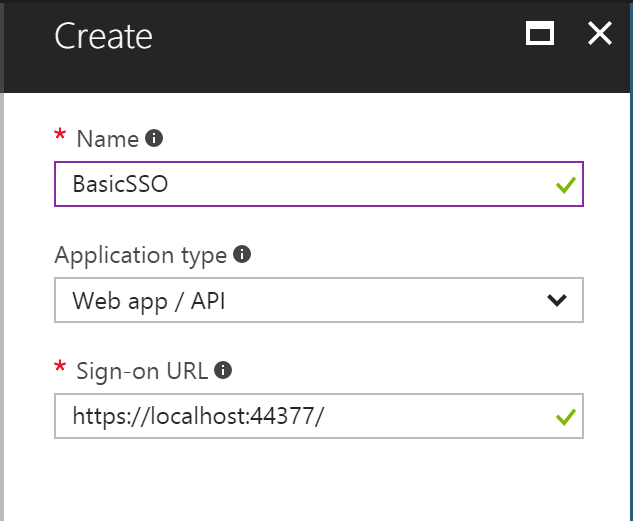
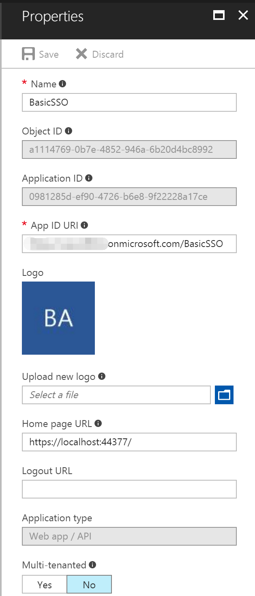
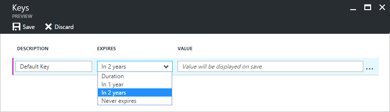

# Basic SSO - Ruby version

In this sample we show you how to integrate Azure Active Directory(Azure AD) to provide secure sign in and authorization. 

**Table of contents**
* [Register the application in Azure Active Directory](#register-the-application-in-azure-active-directory)
* [Prerequisites](#prerequisites)
* [Build and debug locally](#build-and-debug-locally)


## Register the application in Azure Active Directory

1. Sign in to the Azure portal: [https://portal.azure.com/](https://portal.azure.com/).

2. Choose your Azure AD tenant by selecting your account in the top right corner of the page.

3. Click **Azure Active Directory** -> **App registrations** -> **+Add**.

4. Input a **Name**, and select **Web app / API** as **Application Type**.

   Input **Sign-on URL**: https://localhost:44377/

   

   Click **Create**.

5. Once completed, the app will show in the list.

   

6. Click it to view its details. 

   

7. Click **All settings**, if the setting window did not show.

     

     Copy aside **Application ID**, then Click **Save**.

   * Click **Reply URLs**, add the following URL into it.

     [http://localhost:3000/auth/azure_oauth2/callback](http://localhost:3000/auth/azure_oauth2/callback)

   * Click **Required permissions**. Add the following permissions:

     | API                            | Application Permissions | Delegated Permissions         |
     | ------------------------------ | ----------------------- | ----------------------------- |
     | Windows Azure Active Directory |                         | Sign in and read user profile |

     

   * Click **Keys**, then add a new key

     

     Click **Save**, then copy aside the **VALUE** of the key. 

   Close the Settings window.


## Prerequisites

- [Visual Studio Code](https://code.visualstudio.com/Download).
- The [Ruby](https://www.ruby-lang.org/en/downloads) language version 2.2.2 or newer.
- The [RubyGems](https://rubygems.org/) packaging system, which is installed with Ruby by default. To learn more about RubyGems, please read the [RubyGems Guides](http://guides.rubygems.org/).
- The [Rails](http://rubyonrails.org/) web application development framework, version 5.0.0 or above
- A working installation of the [SQLite3 Database](https://www.sqlite.org/).
  ​

## Build and debug locally

1.  Open a terminal, navigate to a directory where you have rights to create files, and type 

      `$ rails new basicsso`

                                            

2. This will create a Rails application called **basicsso** in directory.

3. Close terminal window, copy below file of [Lab Files](Lab%20Files) folder into **basicsso** root folder:

   - Gemfile

4. Copy the following files of [Lab Files](Lab%20Files)  into **basicsso/app/assets/javascripts** folder:

   - app/assets/javascripts/application.js
   - app/assets/javascripts/jqueryval.js
   - app/assets/javascripts/site.js

5. Copy the following folder of [Lab Files](Lab%20Files)  into **basicsso** to replace **/app/assets/stylesheets** folder:

   - app/assets/stylesheets

6. Copy the following files of [Lab Files](Lab%20Files)  into **basicsso/app/helpers** folder:

   - app/helpers/application_helper.rb

7. Copy the following files of [Lab Files](Lab%20Files)  into **basicsso/config** folder:

   - config/application.rb
   - config/settings.yml

8. Copy the following files of [Lab Files](Lab%20Files)  into **basicsso/config/initializers** folder:

   - config/initializers/assets.rb
   - config/initializers/omniauth.rb
   - config/initializers/session_store.rb

9. Copy the following file and folder of [Lab Files](Lab%20Files)  into **basicsso/lib** folder:

   - lib/exceptions.rb
   - lib/omniauth

10. Use vscode open **basicsso** folder:

  

11. Open **app/controllers/application_controller.rb** file, delete all code and  add the following code into it.

    ```typescript
    class ApplicationController < ActionController::Base

      before_action :convert_ssl_header
      around_action :handle_refresh_token_error

      include ApplicationHelper
      helper_method :current_user

      def current_user
        session['_o365_user']
      end

      def set_o365_user(o365_user)
        session['_o365_user'] = o365_user
      end

      def token_service
        @token_service ||= TokenService.new
      end

      def set_session_expire_after(days)
        session.options[:expire_after] = 60 * 60 * 24 * days
      end

      def clear_session_expire_after
        session.options[:expire_after] = nil 
      end

      def handle_refresh_token_error
        begin
          yield
        rescue Exceptions::RefreshTokenError => exception
          redirect_to link_login_o365_required_path
        end
      end

      def azure_oauth2_logout_required
        session['azure_logout_required']
      end

      def azure_oauth2_logout_required=(value)
        session['azure_logout_required'] = value
      end

      def convert_ssl_header
        if request.headers['HTTP_X_ARR_SSL']
          request.headers['HTTP_X_FORWARDED_SCHEME'] = 'https'
        end
      end

    end
    ```

12. Add new file named **account_controller.rb** into **app/controllers/** folder,  add the following code into it.

    ```typescript
    class AccountController < ApplicationController
      
      def index
      end

      def login_o365
         redirect_to azure_auth_path
      end

      def azure_oauth2_callback
        auth = request.env['omniauth.auth']

        # cahce tokens
        token_service.cache_tokens(auth.info.oid, Constants::Resources::AADGraph, 
        auth.credentials.refresh_token, auth.credentials.token, auth.credentials.expires_at)
        set_o365_user(auth.info.email)

        self.azure_oauth2_logout_required = true
        redirect_to account_index_path
      end
       def logoff
        azure_oauth2_logout_required = self.azure_oauth2_logout_required 

        session.clear
        reset_session()
        clear_session_expire_after()

        if azure_oauth2_logout_required 
          post_logout_redirect_uri = URI.escape("#{full_host}/account/index", Regexp.new("[^#{URI::PATTERN::UNRESERVED}]"))
          logoff_url = "#{Constants::AADInstance}common/oauth2/logout?post_logout_redirect_uri=#{post_logout_redirect_uri}"
          redirect_to logoff_url
        else
          redirect_to account_login_path 
        end   
      end

    end
    ```


13. Open **app/views/layouts/application.html.erb** file, delete all code and  add the following code into it.

    ```html
    <!DOCTYPE html>
    <html>
      <head>
        <title><%= content_for?(:title) ? yield(:title) : 'EDUGraphAPI' %></title>
        <meta name="viewport" content="width=device-width, initial-scale=1.0">
        <%= csrf_meta_tags %>
        <%= stylesheet_link_tag    'application', media: 'all', 'data-turbolinks-track': 'reload' %>
        <%= javascript_include_tag 'application', 'data-turbolinks-track': 'reload' %>
      </head>
      <body>
      	<div class="navbar navbar-inverse navbar-fixed-top">
            <div class="container">
                <div class="navbar-header">
                    <button type="button" class="navbar-toggle" data-toggle="collapse" data-target=".navbar-collapse">
                        <span class="icon-bar"></span>
                        <span class="icon-bar"></span>
                        <span class="icon-bar"></span>
                    </button>
                    <a class="navbar-brand" href="/">Basic SSO</a>
                </div>
                <div class="navbar-collapse collapse">
                    <%= yield :user_login_info %>
                </div>
            </div>
        </div>
        <div class="containerbg">
            <div class="container body-content">
                <%= yield %>
                <%= javascript_include_tag 'jqueryval' %>
                <%= javascript_include_tag 'site' %>
                <footer></footer>
            </div>
        </div>
        </div>
      </body>
    </html>
    ```

14. Add new folder named **account** into **app/views** folder,  

15. Add new file named **index.html.erb** into **app/views/account** folder, add the following code into it.

    ```html
    <%= content_for :title, 'Log in - Basic SSO' %>
    <% if current_user %>
        <% content_for :user_login_info do %>
            <form action="/account/logoff" class="navbar-right" id="logoutForm" method="post">
                <div class="userinfo">
                <a href="javascript:void(0);" id="userinfolink"> Hello <%= current_user %>
                </a>
                    <span class="caret" id="caret"></span>
                </div>
                <div class="popupcontainer" id="userinfoContainer">
                <div class="popuserinfo">
                    <div class="subitem">
                        <a href="javascript:document.getElementById('logoutForm').submit()">Log off</a>
                    </div>
                </div>
                </div>
            </form>
        <% end %>
    <% end %>

    <div class="loginbody">
        <div class="row">
            <div class="col-md-5">
                <section id="socialLoginForm">
                <% if current_user %>
                    <h1>Hello World!</h1>
                <% else %>
                    <form action="/account/login_o365" method="post">
                        <div id="socialLoginList">
                            <p><button type="submit" class="btn btn-default btn-ms-login" id="OpenIdConnect" name="provider" value="OpenIdConnect">Sign In With Office 365</button></p>
                        </div>
                    </form>
                <% end %>
                </section>
            </div>
        </div>
    </div>

    <%= stylesheet_link_tag 'login' %>
    ```

16. Add new file named **schema.rb** into **db** folder, add the following code into it to create token cache table.

    ```Ruby
    ActiveRecord::Schema.define(version: 20170501145528) do
      create_table "sessions", force: :cascade do |t|
        t.string   "session_id", null: false
        t.text     "data"
        t.datetime "created_at"
        t.datetime "updated_at"
        t.index ["session_id"], name: "index_sessions_on_session_id", unique: true
        t.index ["updated_at"], name: "index_sessions_on_updated_at"
      end

      create_table "token_caches", force: :cascade do |t|
        t.datetime "created_at",                     null: false
        t.datetime "updated_at",                     null: false
        t.string   "o365_userId"
        t.text     "refresh_token"
        t.text     "access_tokens"
      end

    end
    ```

17. Add new file named **token_cache.rb** into **app/models** folder, add the following code into it to create token cache model.

    ```Ruby
    class TokenCache < ApplicationRecord
    end
    ```

18. Add new file named **constants.rb** into **app/models** folder, add the following code into it .

    ```ruby
    module Constants

      AADInstance = "https://login.microsoftonline.com/"

      module Resources
        MSGraph = 'https://graph.microsoft.com' 
        AADGraph = 'https://graph.windows.net'
      end

    end
    ```

19. Add new folder named **services** into **app** folder.

20. Add new file named **token_service.rb** into **app/services** folder, add the following code into it.

    ```ruby
    class TokenService
        
      def initialize()
      end

      def cache_tokens(o365_user_id, resource, refresh_token, access_token, jwt_exp)
        cache = TokenCache.find_or_create_by(o365_userId: o365_user_id)
        cache.refresh_token = refresh_token
        access_tokens = cache.access_tokens ? JSON.parse(cache.access_tokens) : {}
        access_tokens[resource] = { 
          expiresOn: get_expires_on(jwt_exp), 
          value: access_token 
        }
        cache.access_tokens = access_tokens.to_json();
        cache.save();
      end

      def get_access_token(o365_user_id, resource)
        cache = TokenCache.find_by_o365_userId(o365_user_id)
        if !cache
          raise Exceptions::RefreshTokenError
        end
        # parse access_tokens
        access_tokens = JSON.parse(cache.access_tokens)
        access_token = access_tokens[resource]
        if access_token
          expires_on = DateTime.parse(access_token['expiresOn'])
          utc_now = DateTime.now.new_offset(0)
          if utc_now < expires_on - 5.0 / 60 / 24
            return access_token['value']
          end
        end
        # refresh token and cache
        auth_result = refresh_token(cache.refresh_token, resource)
        access_tokens[resource] = { 
          expiresOn: get_expires_on(auth_result.expires_on), 
          value: auth_result.access_token }
        cache.access_tokens = access_tokens.to_json()
        cache.refresh_token = auth_result.refresh_token
        cache.save()
        #
        return auth_result.access_token;
      end

      def clear_token_cache
        caches = TokenCache.all();
        caches.each do |cache|
          cache.destroy()
        end
      end

      private def refresh_token(refresh_token, resource)
    		authentication_context = ADAL::AuthenticationContext.new
    		client_credential = ADAL::ClientCredential.new(Settings.AAD.ClientId, Settings.AAD.ClientSecret)
        begin
           authentication_context.acquire_token_with_refresh_token(refresh_token, client_credential, resource)
        rescue
          raise Exceptions::RefreshTokenError
        end
      end

      private def get_expires_on(jwt_exp)
        return DateTime.new(1970, 1, 1) + jwt_exp * 1.0 / (60 * 60 * 24)
      end

    end
    ```

21. Open **config/routes.rb** file, delete all code and add the following code into it .

    ```ruby
    Rails.application.routes.draw do
      root to: 'account#index'

      # oauth2
      get 'auth/azure_oauth2', as: :azure_auth
      match 'auth/azure_oauth2/callback', to: 'account#azure_oauth2_callback', via: [:get, :post]

      # account
      get 'account/index'
      get 'account/login'
      post 'account/login_o365'
      match 'account/logoff', via: [:get, :post]

    end
    ```

22. Add new file named **azure_oauth2.rb** into **lib/omniauth/strategies** folder, add the following code into it.

    ```ruby
    require 'omniauth/strategies/oauth2'
    require 'jwt'

    module OmniAuth
      module Strategies

        class AzureOAuth2 < OmniAuth::Strategies::OAuth2

          BASE_AZURE_URL = 'https://login.microsoftonline.com'

          option :name, 'azure_oauth2'
          option :tenant_id, 'common'
          option :resource, 'https://graph.windows.net'
          option :callback_paths, []

          args [:tenant_id]

          def client
            
            options.client_id = options.client_id
            options.client_secret = options.client_secret
            options.tenant_id = options.tenant_id

            options.callback_path = request.params['callback_path'] if request.params['callback_path']

            options.authorize_params.prompt = request.params['prompt'] if request.params['prompt']
            options.authorize_params.login_hint = request.params['login_hint'] if request.params['login_hint']   

            options.client_options.authorize_url = "#{BASE_AZURE_URL}/#{options.tenant_id}/oauth2/authorize"
            options.client_options.token_url = "#{BASE_AZURE_URL}/#{options.tenant_id}/oauth2/token"

            options.token_params.resource = options.resource

            super
          end

          uid {
            raw_info['sub']
          }

          info do
            {
              name: raw_info['name'],
              nickname: raw_info['unique_name'],
              first_name: raw_info['given_name'],
              last_name: raw_info['family_name'],
              email: raw_info['email'] || raw_info['upn'],
              oid: raw_info['oid'],
              tid: raw_info['tid']
            }
          end

          def callback_url
            full_host + script_name + callback_path
          end

          def raw_info
            # it's all here in JWT http://msdn.microsoft.com/en-us/library/azure/dn195587.aspx
            @raw_info ||= ::JWT.decode(access_token.token, nil, false).first
          end

          def on_callback_path?
            options[:callback_paths].include? current_path or super
          end

          protected

          def build_access_token
            options.callback_path = current_path
            super
          end

          def ssl?
            request.env['HTTP_X_ARR_SSL'] || super
          end

        end
      end
    end
    ```

23. Delete the file named **Gemfile.lock** in the root folder of **basicsso**.

24. Open a terminal, navigate to **basicsso** directory again. 

25. Type the following command to set ClientId and ClientSecret and run

    ```rails
    export ClientId=INSERT YOUR CLIENT ID HERE

    export ClientSecret=INSERT YOUR CLIENT SECRET HERE
    ```

      **clientId**: use the Client Id of the app registration you created earlier.

      **clientSecret**: use the Key value of the app registration you created earlier.


23. Type the following command to install bundle and run.

    ```Rails
    bundle install
    ```
    ​

24. Type the following command to create table and run.

    ```rails
    rails db:schema:load
    ```

25. Type the following command to run server.

    ```rails
    rails s
    ```

26. Open a browser window and navigate to [http://localhost:3000](http://localhost:3000/).

27. Press F5, click **Sign In with Office 365** button to sign in.

    

28. Hello world page is presented after login successfully. 

    


**Copyright (c) 2017 Microsoft. All rights reserved.**
